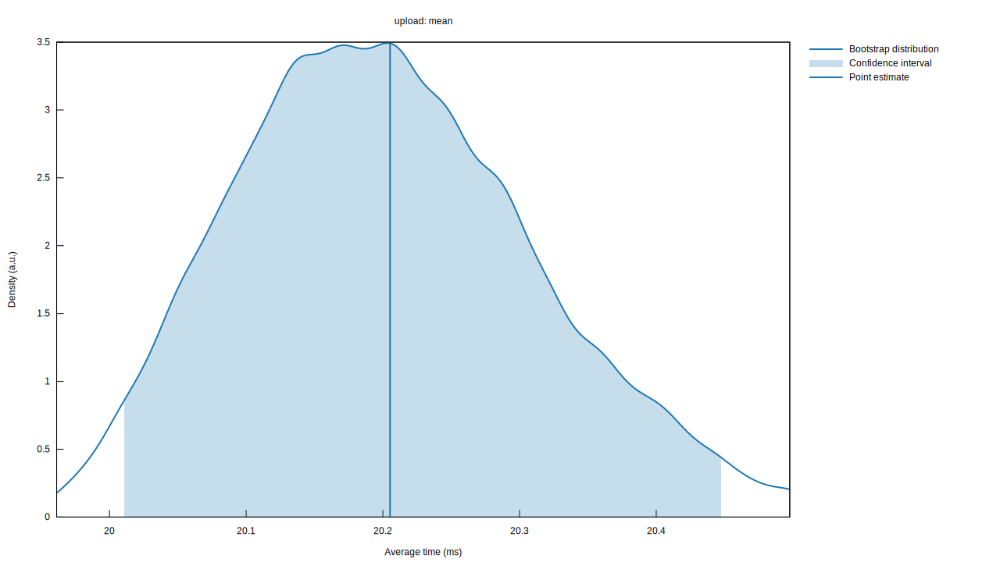

# Lumen 🌄

Lumen is an **astronomically fast** ShareX uploader written in Rust using the [Actix Web](https://github.com/actix/actix-web) framework. It is designed to be **lightweight** and **secure**, providing a self-hosted solution for file uploads.

All uploads are encrypted with **AES-256-GCM-SIV** and only the uploader can decrypt the files.

## Installation 🚀

> **Note:** Lumen is currently in development and may not be stable. Use at your own risk.

### Building from source

```bash
# Clone the repository
git clone https://github.com/checksumdev/lumen.git
cd lumen

# Build the project
cargo build --release

# Run Lumen 🌄 (after you configured the .env file)
./target/release/lumen # or ./target/release/lumen.exe on Windows

# Lumen is now running on http://localhost:8080
```

## Usage 📝

To use Lumen, you need to configure ShareX. An example ShareX configuration file is provided in the examples folder: [Lumen.sxcu](examples/Lumen.sxcu). Download the file and open it.

Make sure to update the values in the configuration file to match your Lumen installation.

## Benchmarks 📊

These benchmarks were performed on a Ryzen 9 3900X with 32GB of RAM. Feel free to run the benchmarks yourself by running `cargo bench` in the project directory with a release server running.

> **WARNING:** The benchmark will create many 1MB files, and will **DELETE ALL** uploads by the test user when it is finished.



## Contributing 🤝

We welcome pull requests from the community. If you have any major changes, please open an issue first to discuss them. When making commits, please follow the [Conventional Commits](https://www.conventionalcommits.org/en/v1.0.0/) specification.

## Support 💬

If you need help with Lumen, feel free to join our [Discord server](https://discord.gg/JcF9sTZPc4) or open an issue.

## License 📜

Lumen is licensed under the [Affero General Public License v3.0](LICENSE).
